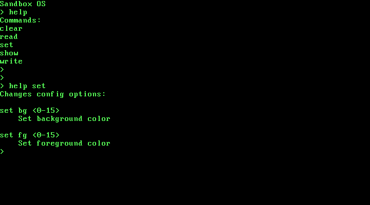

# OS

## Quick Start

Install and build cross-compiler:

`./tools/build-gcc.py`

Build OS (as iso image)

`make iso`

Run in QEMU!

`qemu-system-i386 bin/SandboxOS-x86.iso`

## Requirements

### Building the Cross-Compiler

To build the OS kernel you will need a cross-compiler.
GCC 7.2.0 is the compiler currently being used.
Some other compilers or GCC versions will probably work, but note that support for the C11 and C++14 standards is required.
A script to build a GCC cross-compiler can be found in the tools directory: `build-gcc.py`.
A tutorial can also be found at [OSDev](http://wiki.osdev.org/GCC_Cross-Compiler).
Run `build-gcc.py -h` for help and command line options.

### Assembler

This project uses the NASM assembler.
On Ubuntu, they can be installed as follows:
```
sudo apt install nasm
```


## Building

To build the OS kernel, run `make` in the top-level directory. A GRUB-bootable ISO image can also be created by running `make iso`. Both the kernel binary and ISO image will be placed in the bin directory.

Note: The `xorriso` and `grub-pc-bin` packages may be needed to create the ISO image.
On Ubuntu, they can be installed as follows:
```
sudo apt install xorriso
sudo apt install grub-pc-bin
```


## Running

### Bochs

A Bochs configuration file to boot the ISO image can be found in the top-level directory.
The command is `bochs -f bochsrc-linux.txt`.

### QEMU

QEMU can be used to run either the kernel binary or the ISO image. The respective commands are
`qemu-system-i386 -kernel bin/kernel-x86`
and
`qemu-system-i386 -cdrom bin/SandboxOS-x86.iso`.

### Bare Metal

The ISO image can be copied to a USB drive using the following command replacing `sdx` with the USB drive:

```
sudo dd if=bin/SandboxOS-x86.iso of=/dev/sdx
```

**IMPORTANT**: The `dd` command will wipe the contents of your USB drive. Also, if you accidentally point it to another drive (say, your hard drive), it may wipe that too!


## Shell

The OS has a simple shell for debugging purposes. Type `help` to list the available commands. Type `help <cmd>` to get help on a specific command.


